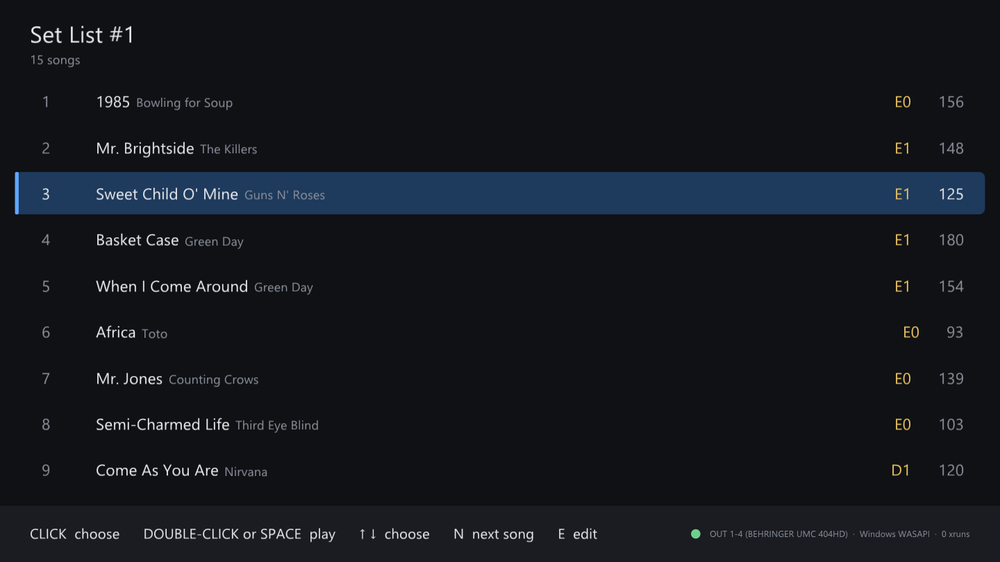
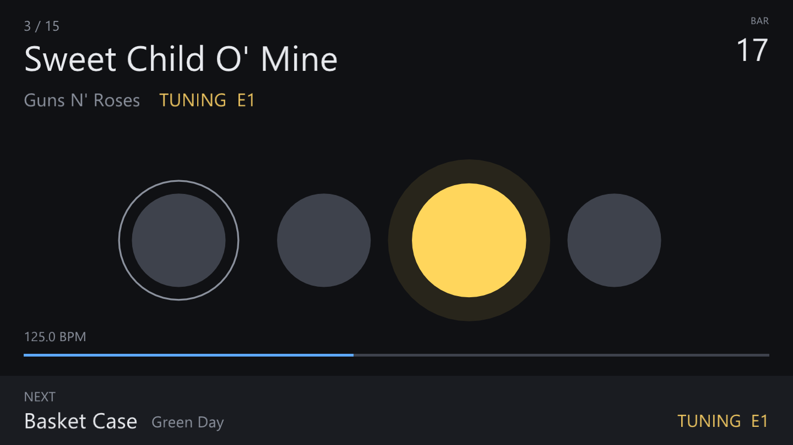
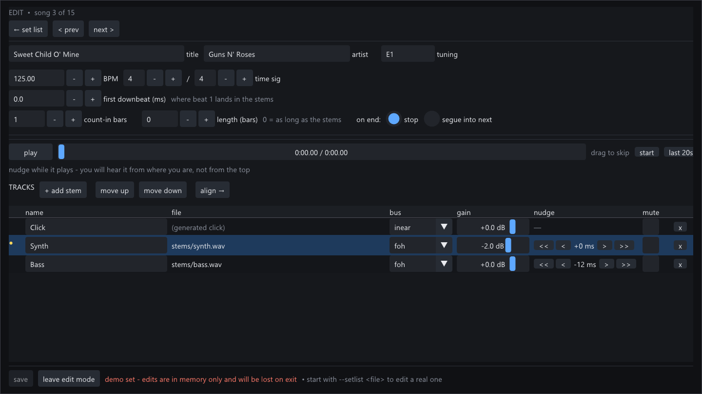
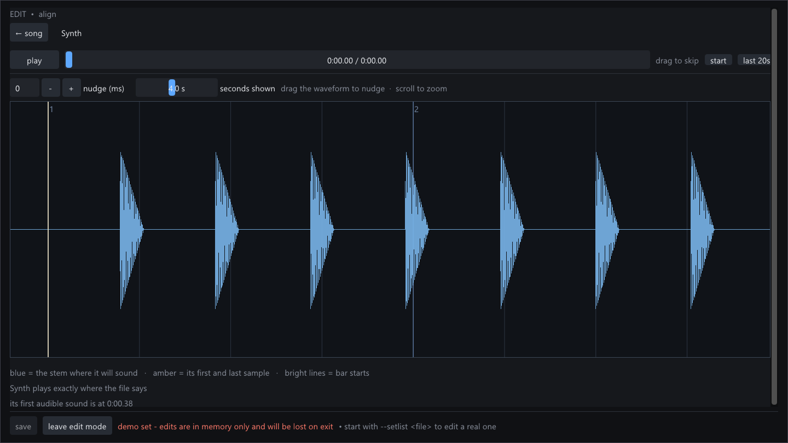
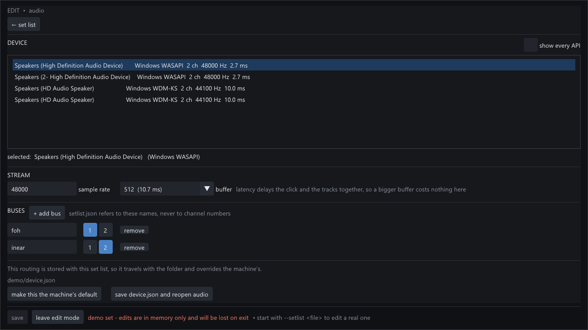
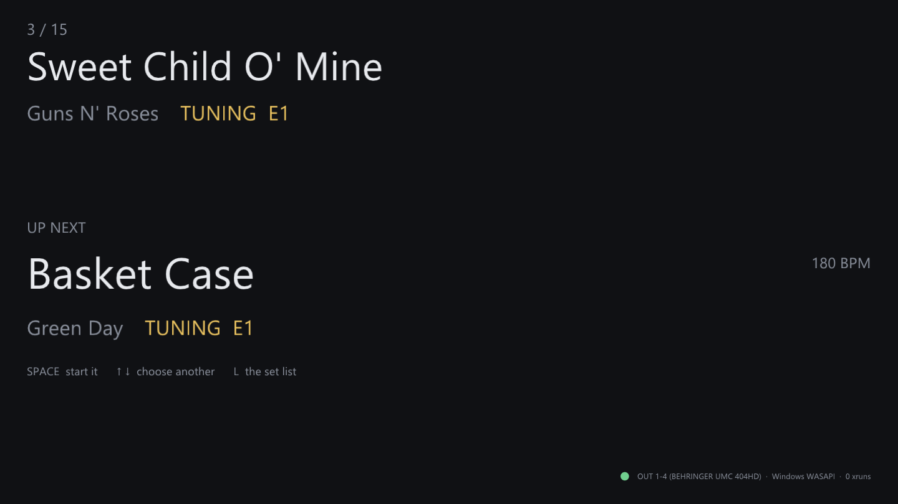

# BackingTrackLive

Backing tracks for a live band, without a DAW in the way.

Load your set list, pick a song, hit the space bar. The click goes to the
in-ears, the backing tracks go to front of house, and nothing surprising
happens at 11pm in a bar.

Free and open source, for Windows. [Download the latest
release](https://github.com/galoryber/BackingTrackLive/releases/latest), unzip
it, and run **BackingTrackLive.exe**. Nothing to install.

---

## What it does

**Your set list is a list of songs.** Not one long timeline with markers in it.
Click a song, it plays. Click another, that one plays.

**The click track is separate from the music.** Send the click to the drummer's
in-ears on one pair of outputs and the backing tracks to the desk on another.
Set it up once on screen; it is remembered.

**Songs can run straight into the next one.** Mark a song to segue and it does,
counting in at the new tempo if you want it to.

**You can see what you are about to play.** Song, artist, tempo — and the
tuning, if you keep your guitars in different ones.

The big thing in the middle is the beat. The bar number is in the corner, the
song is top left, and what is coming next is along the bottom. It is readable
from across a stage.

## Getting your songs in

Buy or make your backing tracks however you already do — WAV, FLAC or MP3 all
work. Then:

**1. Make a set list.** Open the program and choose *New set list*. It makes a
folder with one song in it.

**2. Add your stems.** In edit mode, *+ add stem* and pick the file. It copies
into the set list folder, so the whole folder stays something you can put on a
USB stick and hand to the backup laptop.

**3. Tell it the tempo.** Type in the BPM the track was made at. There is no
tempo detection and no time-stretching — this plays your files as they are.

**4. Line it up.** Downloaded backing tracks almost always start with a bit of
silence before the music, and how much is anyone's guess. Select the stem, hit
*align*, and drag it until it sits on the beat.

The vertical lines are the beats, the brighter ones are bars. The blue is your
stem, drawn where it will actually sound. Drag it, scroll to zoom, and press
play to hear it from wherever you are looking.

If it lines up at the start and stays lined up at the end, you are done. If it
drifts, the tempo you were given is wrong rather than the alignment.

## Sending the click somewhere separate

*Edit → audio* lists whatever interfaces are plugged in. Pick one, and say
which outputs are front of house and which are the in-ears. On a four-output
interface the usual answer is 1–2 and 3–4, which it fills in for you.

This is a property of the laptop, not of the set list, so you do it once and
every set list you open uses it. It survives upgrading the program.

## During the show

| | |
|---|---|
| `SPACE` | play the selected song |
| `↑` `↓` or click | choose a different song |
| `N` | skip to the next song |
| `E` | edit mode (blocked while playing) |
| `F11` | full screen |
| `ESC` | leave full screen — never quits |

When a song finishes, the screen stays put and shows what is next, so one key
starts it.

## Before the gig

*Edit → check* reads every song and every stem and tells you everything wrong
with the set at once — a missing file, a stem that is silent because the wrong
thing got downloaded, a song pointed at an output your interface does not have.
Better to find out at home.

## What it deliberately does not do

No plugins, no recording, no mixing beyond level and mute, no tempo detection,
no time-stretching. It plays fixed files in a fixed order through fixed
outputs. That is the whole idea: everything it does not do is something that
cannot go wrong on stage.

## Known limits

- **Windows only** in practice. The engine builds and its tests pass on macOS
  and Linux, but there is no UI build for them.
- **No ASIO** in the downloadable builds — the Steinberg SDK cannot be
  redistributed, so released binaries use WASAPI. On a four-output interface
  that still gives four separate outputs, measured at about 22 ms.
  See [docs/asio.md](docs/asio.md).
- **A song that changes tempo partway through** has to have its tempo map
  written into `setlist.json` by hand. See [docs/roadmap.md](docs/roadmap.md).
- **No MIDI**, so no footswitch yet.

## Documentation

| | |
|---|---|
| [docs/gig-laptop.md](docs/gig-laptop.md) | setting up the laptop that plays the show, and where files live |
| [docs/asio.md](docs/asio.md) | ASIO, and why released builds do not have it |
| [docs/roadmap.md](docs/roadmap.md) | what is planned, and what is deliberately not |
| [docs/release-notes/](docs/release-notes/) | what changed in each version |
| [docs/development.md](docs/development.md) | building from source, the design, the test suite |
| [docs/resampling.md](docs/resampling.md) | the resampler, measured |

## License

Apache-2.0. See [LICENSE](LICENSE) and [NOTICE](NOTICE).
